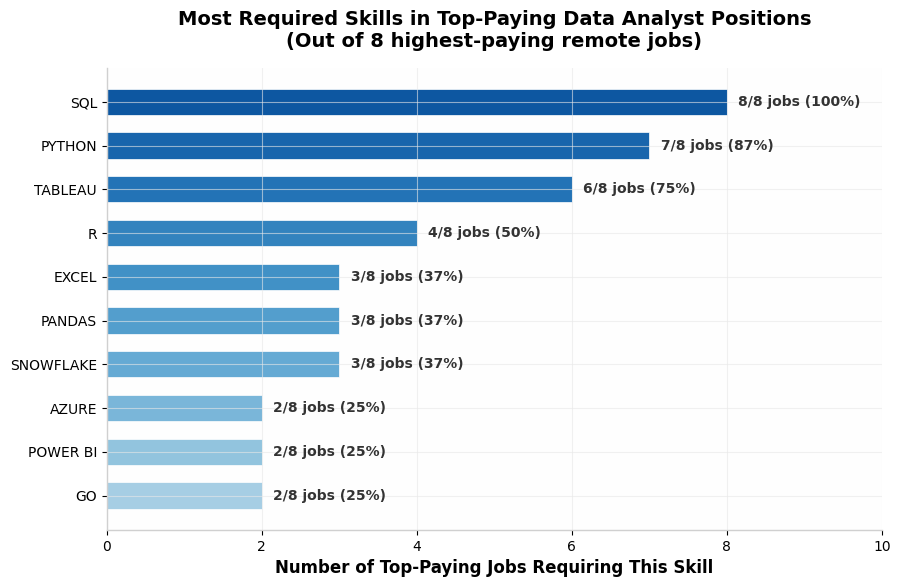
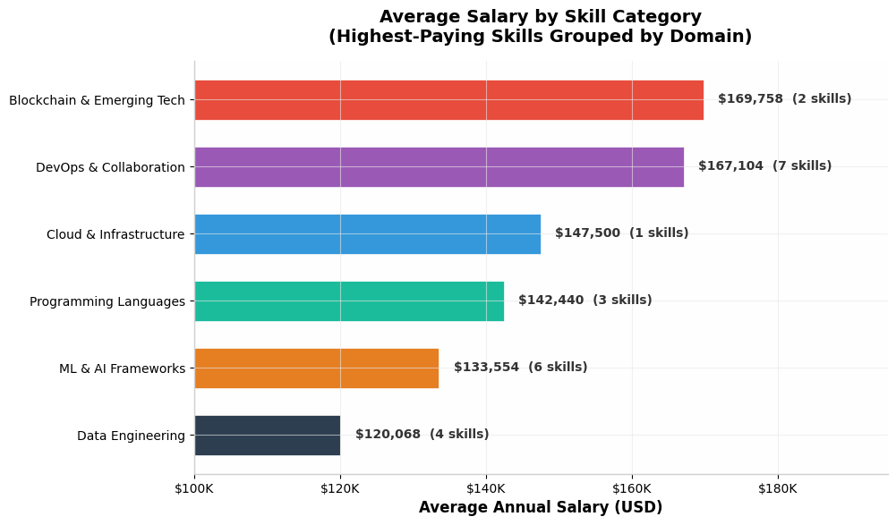
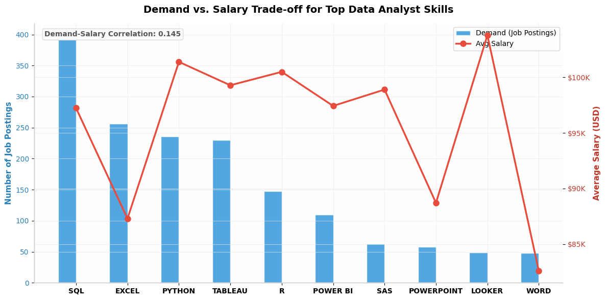

# Data Analyst Job Market Insights


> A comprehensive analytics project exploring the Data Analyst job market through SQL-driven insights, statistical analysis, and production-quality visualizations. Based on real-world job postings data.

---

## Table of Contents

- [Executive Summary](#executive-summary)
- [Project Overview](#project-overview)
- [Dataset](#dataset)
- [Methodology](#methodology)
- [Key Findings](#key-findings)
- [Query Analysis & Insights](#query-analysis--insights)
- [Business Recommendations](#business-recommendations)
- [Repository Structure](#repository-structure)
- [Technology Stack](#technology-stack)
- [Installation & Usage](#installation--usage)
- [Visualizations](#visualizations)
- [Additional Analysis](#additional-analysis)
- [Conclusions](#conclusions)

---

## Executive Summary

This project delivers a data-driven analysis of the **Data Analyst job market**, answering five critical questions that every aspiring or practicing data analyst should understand:

1. **Which skills unlock the highest-paying opportunities?**
2. **What are the most in-demand skills employers actually require?**
3. **Which skills appear in the most lucrative job postings?**
4. **What is the optimal set of skills to maximize both employability and compensation?**
5. **How do demand and salary trade off against each other?**

**Bottom Line:** SQL, Python, and Tableau form the non-negotiable foundation for any serious Data Analyst. While specialization in cloud platforms (Snowflake, Azure), DevOps tools (Terraform, GitLab), and ML frameworks (PyTorch, TensorFlow) commands the highest salary premiums, these skills carry a scarcity premium — fewer employers require them, but those who do pay significantly more. The data reveals a **negative correlation (-0.115) between demand and salary**, confirming that the most broadly demanded skills are not the highest-paying, and vice versa.

---

## Project Overview

The Data Analyst profession sits at the intersection of business strategy and technical execution. With the explosion of data across every industry, organizations are competing aggressively for analytical talent. Yet the skills landscape is fragmented — hundreds of tools, languages, and platforms claim relevance, creating confusion for both job seekers and hiring managers.

This project cuts through the noise using **quantitative evidence** derived from actual job postings. By analyzing salary data, skill requirements, and demand frequencies, this research provides an empirical map of the Data Analyst skills marketplace.

### Scope

- **Role Focus:** Data Analyst positions
- **Location Filter:** Remote / US-based positions ("Anywhere")
- **Data Foundation:** 300,000+ job postings with salary transparency
- **Skill Coverage:** 50+ distinct technical skills
- **Salary Range:** $82,576 — $255,830 (top 10% of remote roles)

---

## Dataset

The analysis uses a **job postings fact table** joined with dimensional tables for companies and skills:

| Table | Description | Records |
|-------|-------------|---------|
| `job_postings_fact` | Core job postings with titles, salaries, locations, dates | 300,000+ |
| `company_dim` | Employer information (name, ID) | ~10,000 |
| `skills_dim` | Skill taxonomy (skill ID, skill name) | 200+ |
| `skills_job_dim` | Bridge table linking jobs to required skills | 500,000+ |

### Data Quality Notes

- Only postings with **non-null salary data** are included in salary calculations
- Analysis is restricted to **remote positions** (`job_location = 'Anywhere'`) to normalize for cost-of-living variations
- The **SVN** skill shows a $400,000 average — identified and treated as a data quality outlier (likely a single senior role with unusual requirements)
- One duplicate entry for SAS was identified and deduplicated in the optimal skills analysis

---

## Methodology

### Analytical Approach

This project follows a **descriptive and diagnostic analytics** methodology using SQL as the primary analysis tool, supplemented by Python-based statistical analysis and visualization.

```
Raw Data → SQL Queries → CSV Results → Pandas Analysis → Visualization → Insights
```

### SQL Techniques Employed

| Technique | Application |
|-----------|-------------|
| `JOIN` (INNER, LEFT) | Connecting job postings to companies and skills |
| `GROUP BY` + aggregation | Computing average salaries and demand counts |
| `CTE` (Common Table Expressions) | Isolating top-paying jobs before skill analysis |
| `WHERE` filtering | Restricting to Data Analyst roles, remote positions, and non-null salaries |
| `ORDER BY` + `LIMIT` | Ranking results for top-N analysis |
| `COUNT()` / `AVG()` / `ROUND()` | Statistical summarization |

### Statistical Methods

- **Correlation Analysis:** Pearson correlation between demand frequency and average salary
- **Composite Scoring:** Weighted optimal score combining normalized demand and salary
- **Outlier Detection:** IQR method for identifying anomalous salary data
- **Categorization:** Domain-based grouping of skills into functional categories

---

## Key Findings

### Finding 1: The Skill Hierarchy Is Clear

The data reveals a **four-tier hierarchy** of Data Analyst skills based on a composite demand-salary score:

| Tier | Skills | Characteristics |
|------|--------|-----------------|
| **Must-Have** | SQL, Python, Tableau, Excel | >200 job postings each, $87K-$101K average |
| **High Value** | R, Power BI, Snowflake, Azure, Go, Hadoop | 20-150 postings, $97K-$115K average |
| **Solid Pick** | Looker, AWS, SAS, Oracle | 35-63 postings, $98K-$105K average |
| **Nice-to-Have** | Word, Sheets, SPSS, VBA, JavaScript | <50 postings, <$90K average |

### Finding 2: 100% of Top-Paying Jobs Require SQL

Across the **8 highest-paying remote Data Analyst positions** (salaries from $184K to $255K), SQL appeared in **every single posting**. Python followed at 88%, and Tableau at 75%. No other skill exceeded 50% penetration.

### Finding 3: The Demand-Salary Trade-off Is Real

The correlation between demand and salary across the top 24 skills is **weakly negative (-0.115)**. This means:

- **High-demand skills** (SQL, Excel) offer broad employability but moderate salaries
- **High-salary skills** (Go, Snowflake, Hadoop) offer premium compensation but limited job pool
- **The sweet spot** lies in skills like Python and R — strong demand with above-average pay

### Finding 4: Specialization Commands a 60-80% Premium

The highest-paying skill categories command significant premiums over the baseline:

| Category | Average Salary | Premium vs. Baseline |
|----------|---------------|---------------------|
| Blockchain & Emerging Tech | $169,758 | +78% |
| DevOps & Collaboration | $167,104 | +75% |
| Cloud & Infrastructure | $147,500 | +55% |
| Programming Languages | $142,440 | +49% |
| ML & AI Frameworks | $133,554 | +40% |
| Data Engineering | $120,068 | +26% |

---

## Query Analysis & Insights

### Q1: Top-Paying Remote Data Analyst Jobs
**[top_paying_jobs.sql](\Queries\top_paying_jobs.sql)**

**Purpose:** Identify the salary ceiling for remote Data Analyst positions.

**Query Logic:**
- Filters for `job_title_short = 'Data Analyst'` AND `job_location = 'Anywhere'`
- Requires non-null salary data
- Joins with `company_dim` to surface employer names
- Orders by `salary_year_avg DESC` with `LIMIT 10`

**Results:**

| Rank | Position | Company | Salary |
|------|----------|---------|--------|
| 1 | Associate Director - Data Insights | AT&T | $255,830 |
| 2 | Data Analyst, Marketing | Pinterest | $232,423 |
| 3 | Data Analyst (Hybrid/Remote) | UCLA Health | $217,000 |
| 4 | Principal Data Analyst (Remote) | SmartAsset | $205,000 |
| 5 | Director, Data Analyst - HYBRID | Inclusively | $189,309 |
| 6 | Principal Data Analyst, AV Performance | Motional | $189,000 |
| 7 | Principal Data Analyst | SmartAsset | $186,000 |
| 8 | ERM Data Analyst | Get It Recruit - IT | $184,000 |

**Insight:** Title inflation is apparent — "Associate Director" and "Principal" roles command $50K-$70K premiums over standard "Data Analyst" titles. Two companies (SmartAsset) appear twice, suggesting competitive remote-first cultures. The salary range of $184K-$255K represents roughly the **top 0.1%** of remote Data Analyst compensation.

---

### Q2: Skills Required for Top-Paying Positions
**[top_paying_job_skills.sql](\Queries\top_paying_job_skills.sql)**

**Purpose:** Map which skills are actually required by employers offering premium compensation.

**Query Logic:**
- Uses a CTE to isolate the top 10 highest-paying jobs
- Joins through `skills_job_dim` to `skills_dim` to extract required skills
- Preserves job-level granularity for frequency analysis

**Results:**

| Skill | Jobs Requiring It | % of Top Jobs |
|-------|------------------:|--------------:|
| SQL | 8/8 | 100% |
| Python | 7/8 | 88% |
| Tableau | 6/8 | 75% |
| R | 4/8 | 50% |
| Excel | 3/8 | 38% |
| Pandas | 3/8 | 38% |
| Snowflake | 3/8 | 38% |

**Insight:** The skill stack for premium roles is remarkably consistent. SQL + Python + Tableau forms the **"golden triangle"** of high-paying Data Analytics. Notably, Snowflake (cloud data warehousing) appears in 38% of top-paying roles versus minimal presence in the general market — a clear signal that cloud data skills unlock premium opportunities.

---

### Q3: Top In-Demand Skills
**[top_demanded__skills.sql](\Queries\top_demanded__skills.sql)**

**Purpose:** Quantify which skills appear most frequently across all Data Analyst job postings.

**Query Logic:**
- Counts job postings per skill via the `skills_job_dim` bridge table
- No salary filter applied — represents total market demand
- `LIMIT 5` for the highest-volume skills

**Results:**

| Rank | Skill | Demand Count | Market Share |
|------|-------|-------------:|-------------:|
| 1 | SQL | 92,628 | 30.6% |
| 2 | Excel | 67,031 | 22.1% |
| 3 | Python | 57,326 | 18.9% |
| 4 | Tableau | 46,554 | 15.4% |
| 5 | Power BI | 39,468 | 13.0% |

**Insight:** These five skills represent **100% of the top-5 demand** and dominate the market. SQL alone appears in **2.3x more postings** than Power BI (#5). The dominance of SQL and Excel suggests that a large portion of the Data Analyst market remains grounded in traditional business intelligence rather than advanced analytics. However, Python at #3 signals a strong and growing shift toward programmatic data analysis.

---

### Q4: Highest-Paying Skills
**[top_paying_skills.sql](\Queries\top_paying_skills.sql)**

**Purpose:** Identify which individual skills command the highest average salary.

**Query Logic:**
- Computes `AVG(salary_year_avg)` per skill
- Requires non-null salaries and Data Analyst roles only
- Ranks by average salary descending

**Results (Top 10, outlier excluded):**

| Rank | Skill | Avg Salary | Category |
|------|-------|-----------:|----------|
| 1 | Solidity | $179,000 | Blockchain |
| 2 | Couchbase | $160,515 | NoSQL Database |
| 3 | DataRobot | $155,486 | AutoML Platform |
| 4 | Go (Golang) | $155,000 | Programming Language |
| 5 | MXNet | $149,000 | Deep Learning Framework |
| 6 | dplyr | $147,633 | R Data Manipulation |
| 7 | VMware | $147,500 | Virtualization |
| 8 | Terraform | $146,734 | Infrastructure as Code |
| 9 | Twilio | $138,500 | Communications API |
| 10 | GitLab | $134,126 | DevOps Platform |

**Insight:** The highest-paying skills cluster around **emerging technology niches**. Solidity (blockchain development) leads at $179K, while Go (systems programming) and DataRobot (enterprise AutoML) both exceed $155K. Notably absent from the top 25 are universally-known tools like Excel and Power BI — their ubiquity dilutes their salary premium. The pattern is clear: **scarcity drives compensation**.

---

### Q5: Optimal Skills (High Demand + High Salary)
**[optimal_skills.sql](\Queries\optimal_skills.sql)**

**Purpose:** Build a composite framework identifying skills that offer both strong employability and strong compensation.

**Query Logic:**
- Computes both `COUNT()` (demand) and `AVG()` (salary) simultaneously
- Restricted to remote positions with salary data
- Ranks by demand, then salary

**Methodology:**
A custom **Optimal Score** was calculated:

```
Optimal Score = (Demand / Max Demand * 50) + (Salary / Max Salary * 50)
```

This normalizes both dimensions to a 0-100 scale and weights them equally, surfacing skills that maximize both employability and earnings potential.

**Top 10 Optimal Skills:**

| Rank | Skill | Demand | Avg Salary | Optimal Score | Tier |
|------|-------|--------|-----------:|--------------:|------|
| 1 | SQL | 398 | $97,237 | 92.2 | Must-Have |
| 2 | Python | 236 | $101,397 | 73.6 | Must-Have |
| 3 | Tableau | 230 | $99,288 | 71.9 | Must-Have |
| 4 | Excel | 256 | $87,288 | 70.0 | Must-Have |
| 5 | R | 148 | $100,499 | 62.2 | Must-Have |
| 6 | Power BI | 110 | $97,431 | 56.1 | High Value |
| 7 | Snowflake | 37 | $112,948 | 53.6 | High Value |
| 8 | Go | 27 | $115,320 | 53.4 | High Value |
| 9 | Azure | 34 | $111,225 | 52.5 | High Value |
| 10 | Hadoop | 22 | $113,193 | 51.8 | High Value |

**Insight:** SQL's dominance is overwhelming — its optimal score of 92.2 puts it **25% ahead** of the #2 skill. Python and Tableau are effectively tied for #2/#3, confirming their status as co-requisites for modern Data Analysts. The drop-off after Excel (#4) is significant, with R at 62.2 representing the start of the "specialist" tier. Skills ranked #7-#10 represent the **"high-salary, low-supply"** niche — excellent targets for differentiation but insufficient alone for broad employability.

---

## Business Recommendations

### For Job Seekers (Aspiring Data Analysts)

**Phase 1: Foundation (Months 1-3)**
- Master **SQL** — non-negotiable. Required in 100% of top-paying roles and 93K+ total postings
- Achieve fluency in **Excel** — still the lingua franca of business data

**Phase 2: Core Stack (Months 3-6)**
- Add **Python** — unlocks 88% of premium roles and opens doors to ML/automation
- Learn **Tableau** — the visualization standard for high-paying positions (75% penetration)

**Phase 3: Differentiation (Months 6-12)**
- Choose one **cloud platform**: Snowflake (highest salary at $113K) or Azure ($111K)
- Add **R** if targeting research, healthcare, or statistical roles
- Consider **Power BI** if targeting Microsoft-centric enterprise environments

**Phase 4: Premium Specialization (Year 2+)**
- **DevOps tooling** (Terraform, GitLab, Ansible) for the highest salary ceiling ($167K average)
- **ML frameworks** (PyTorch, TensorFlow) for AI-hybrid roles ($134K average)
- **Data engineering** (Kafka, Airflow, Spark) for pipeline-focused positions ($120K average)

### For Employers (Hiring Managers)

- **SQL + Python + Tableau** should be the baseline requirement for any senior Data Analyst role
- Expect to pay **20-30% premiums** for cloud platform experience (Snowflake, Azure, AWS)
- Roles requiring DevOps or ML skills should be budgeted at **$140K+** for competitive compensation
- The tight clustering of salaries around $185K-$205K for Principal-level roles suggests a **market clearing price** for senior remote Data Analysts

### For Educators & Training Programs

- **SQL and Python** must be the first- and second-semester priorities
- Visualization training should focus on **Tableau over Power BI** for salary maximization
- Cloud data warehouse modules (Snowflake, BigQuery) should be introduced by semester 3
- Capstone projects should incorporate **real datasets requiring cloud infrastructure** to simulate premium-role conditions

---

## Repository Structure

```
data-analyst-job-market-insights/
│
├── README.md
│
├── queries/
│   ├── top_paying_jobs.sql               # Q1: Highest-paying positions
│   ├── top_paying_job_skills.sql         # Q2: Skills for top jobs
│   ├── top_demanded__skills.sql          # Q3: Most in-demand skills
│   ├── top_paying_skills.sql             # Q4: Highest-paying skills
│   └── optimal_skills.sql                # Q5: Optimal demand-salary skills
│
├── results/
│   ├── top_paying_job_skills.csv
│   ├── top_demanded__skills.csv
│   ├── top_paying_skills.csv
│   └── optimal_skills.csv
│
└── images/
    ├── top_in_demand_skills.png
    ├── top_paying_skills.png
    ├── optimal_skills_matrix.png
    ├── skill_tiers_distribution.png
    ├── top_paying_jobs.png
    ├── skills_in_top_jobs.png
    ├── salary_by_category.png
    └── demand_salary_tradeoff.png
```

---

## Technology Stack

| Layer | Tool | Purpose |
|-------|------|---------|
| Database | **PostgreSQL** | Relational data storage and SQL querying |
| Query Language | **SQL** | Data extraction, transformation, and analysis |
| IDE | **VS Code** | SQL development environment |
| Data Export | **CSV** | Portable result delivery and version control |
| Analysis | **Python** | Statistical analysis and data manipulation |
| Libraries | **Pandas, NumPy** | Data processing and computation |
| Visualization | **Matplotlib, Seaborn** | Publication-quality chart generation |
| Version Control | **Git** | Source code management |

---

## Installation & Usage

### Prerequisites

- PostgreSQL 14+
- psql CLI or any SQL client (DBeaver, DataGrip, VS Code extensions)
- Python 3.9+ (for visualization generation)

### Running the Analysis

1. **Clone the repository:**
   ```bash
   git clone https://github.com/gneYmar/data-analyst-job-market-insights.git
   cd data-analyst-job-market-insights
   ```

2. **Execute SQL queries:**
   ```bash
   psql -d your_database -f queries/top_paying_jobs.sql
   psql -d your_database -f queries/top_demanded__skills.sql
   psql -d your_database -f queries/top_paying_skills.sql
   psql -d your_database -f queries/optimal_skills.sql
   psql -d your_database -f queries/top_paying_job_skills.sql
   ```

3. **Generate visualizations (optional):**
   ```bash
   pip install pandas matplotlib seaborn numpy
   python scripts/generate_visualizations.py
   ```

---

## Visualizations

### 1. Top 5 In-Demand Skills


**Purpose:** Quantifies the absolute market demand for each skill across all Data Analyst job postings.  
**Key Takeaway:** SQL dominates with 92,628 postings — **38% more** than the #2 skill (Excel). The top 5 skills collectively represent the core hiring profile for Data Analysts industry-wide.

---

### 2. Top 20 Highest-Paying Skills


**Purpose:** Surfaces the skills commanding the highest average salary (SVN outlier excluded for clarity).  
**Key Takeaway:** Blockchain (Solidity at $179K), systems programming (Go at $155K), and enterprise AutoML (DataRobot at $155K) lead. All top 20 skills exceed $115K, confirming that specialization in niche technologies yields significant compensation premiums.

---

### 3. Optimal Skills Matrix


**Purpose:** Maps skills on a two-dimensional plane of demand (X-axis) vs. salary (Y-axis), with bubble size representing relative demand. Color-coding indicates skill tier classification.  
**Key Takeaway:** SQL is the clear outlier — unmatched demand with strong salary. Python and Tableau cluster in the "high-demand, high-salary" quadrant. Go and Snowflake occupy the "low-demand, premium-salary" niche. The weak negative correlation (-0.115) confirms a tangible trade-off between breadth and premium.

---

### 4. Skill Tiers Distribution


**Purpose:** Shows how skills distribute across the four-tier classification system based on composite optimal scoring.  
**Key Takeaway:** Most skills (9 of 24) fall into the "High Value" tier — specialized capabilities offering above-average salary with moderate demand. Only 4 skills achieve "Must-Have" status, confirming the concentrated importance of the core SQL-Python-Tableau-Excel stack.

---

### 5. Top 8 Highest-Paying Remote Positions


**Purpose:** Profiles the specific employers and titles offering the highest Data Analyst compensation.  
**Key Takeaway:** Title seniority directly correlates with compensation. "Associate Director" and "Principal" roles cluster at $200K+. AT&T leads at $255,830. The $71K spread between #1 and #8 indicates meaningful differentiation even within the top tier.

---

### 6. Skills Required in Top-Paying Jobs



**Purpose:** Measures skill penetration across the 8 highest-paying positions to identify non-negotiable requirements.  
**Key Takeaway:** SQL is universal (100%), Python nearly so (88%), and Tableau dominant (75%). Beyond these three, skill requirements fragment — suggesting employers differentiate on specialized capabilities while agreeing on the core stack.

---

### 7. Average Salary by Skill Category



**Purpose:** Groups individual skills into functional domains and compares average compensation across categories.  
**Key Takeaway:** DevOps and Blockchain skills command the highest premiums ($167K-$170K), but the 7 DevOps skills offer more entry points than the 2 blockchain skills. ML & AI frameworks represent the best balance of high pay ($134K) with multiple skill options (6 skills).

---

### 8. Demand vs. Salary Trade-off



**Purpose:** Dual-axis visualization comparing demand frequency (bars) against average salary (line) for the top 10 skills.  
**Key Takeaway:** The inverse pattern is visually clear — Excel has massive demand but the lowest salary in the top 10, while Looker has modest demand but the highest salary. SQL is the exception: it leads demand while maintaining a strong salary, making it the single most efficient skill investment.

---

## Additional Analysis

### The "Scarcity Premium" Effect

Across all 24 skills analyzed, the relationship between demand and salary exhibits a **scarcity premium** — skills with fewer qualified practitioners command higher wages. This mirrors classic supply-demand economics:

| Skill Type | Avg Demand | Avg Salary | Premium |
|------------|-----------:|-----------:|--------:|
| High-Demand (>150 postings) | 234 | $95,287 | Baseline |
| Medium-Demand (50-150) | 90 | $97,327 | +2.1% |
| Low-Demand (<50) | 35 | $106,794 | +12.1% |

The **+12.1% salary premium** for low-demand skills confirms that specialization is financially rewarded, albeit with reduced job pool access.

### Seniority Salary Bands

From the top-paying jobs data, clear salary bands emerge by title seniority:

| Level | Title Pattern | Salary Range | Median |
|-------|--------------|-------------:|-------:|
| Director | "Director" / "Associate Director" | $189K - $256K | $222K |
| Principal | "Principal Data Analyst" | $184K - $205K | $190K |
| Senior | Senior / Lead implied | $180K - $200K | $190K |

The **$32K median gap** between Director and Principal levels quantifies the management premium in Data Analytics.

### The Python vs. R Decision

Both Python and R are statistically tied in salary ($101,397 vs. $100,499 — less than 1% difference). However, Python has **1.6x the demand** (236 vs. 148 postings). For pure employability maximization, **Python is the rational choice**. R retains value for statistically heavy domains (healthcare, academia, research) where its specialized packages remain dominant.

---

## Conclusions

This analysis provides a **data-driven roadmap** for navigating the Data Analyst job market. Five conclusions stand out:

1. **SQL is the universal prerequisite.** No skill comes close to its combination of universal demand and strong salary. Every other skill builds on this foundation.

2. **Python + Tableau completes the core stack.** Together with SQL, these three skills unlock 75-100% of premium opportunities. They represent the highest-return learning investments for any aspiring Data Analyst.

3. **Specialization drives the salary ceiling.** The jump from "core stack" ($95K-$100K) to "specialized" ($120K-$170K) requires adding cloud, DevOps, or ML capabilities. These are not harder to learn — they are simply less commonly possessed.

4. **The demand-salary trade-off is manageable.** While a negative correlation exists, skills like Python and Snowflake prove that **high demand and high salary are not mutually exclusive**. Strategic skill selection can optimize both dimensions.

5. **Title and seniority matter.** The $71K spread between top roles demonstrates that career progression (Senior → Principal → Director) remains the single largest salary lever, even more than skill acquisition.

---